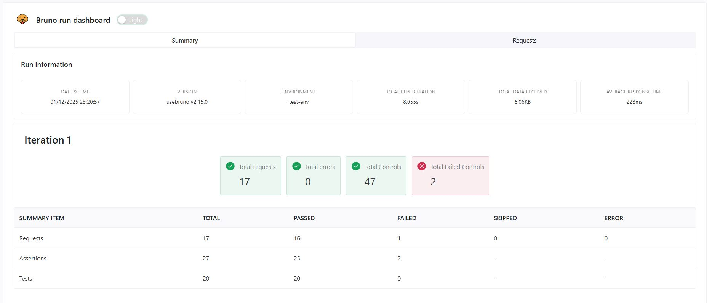
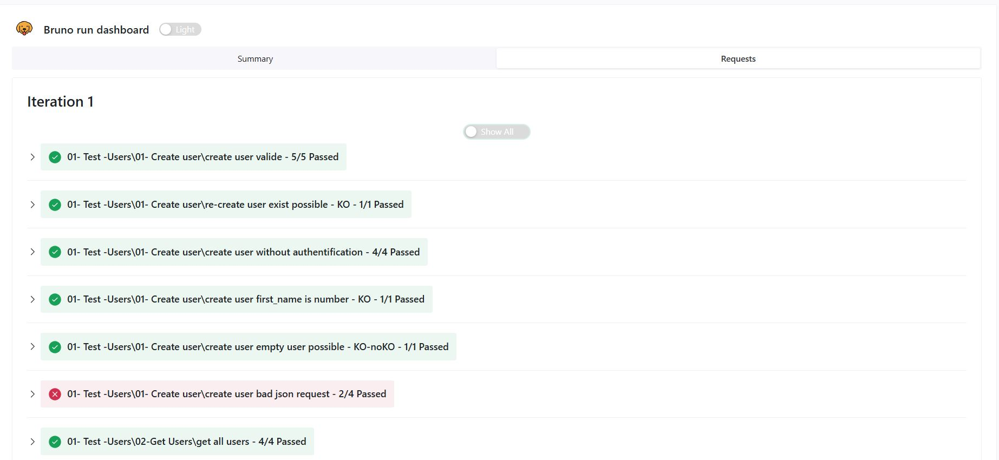

# Bruno Test API Project

**Generated by GitHub Copilot AI agent integrated to VS Code**

This project contains automated API tests for the [ReqRes API](https://reqres.in/) using [Bruno](https://www.usebruno.com/), a modern open-source API client.

## Overview

Bruno API test suite for ReqRes with complete test coverage (user creation, retrieval, updates). Tests can be executed locally via Bruno GUI or CLI with automatic HTML and JUnit XML report generation.

## Project Structure

```
ReqResAPI/
├── bruno.json                      # Project metadata & configuration
├── collection.bru                  # Global headers, variables, pre-request scripts & tests
├── environments/
│   └── test-env.bru               # Environment variables (base_url, etc.)
├── 01-Test-Users/                 # Test suites
│   ├── 01-Create User/            # User creation tests
│   ├── 02-Get Users/              # User retrieval & pagination tests
│   ├── 03-Get User By ID/         # Get single user tests
│   └── 04-Patch User/             # User update tests
├── 99-util/
│   └── util.js                    # Utility functions (date formatting)
└── .github/workflows/
    └── api-tests.yml              # CI/CD workflow (GitHub Actions)
```

## Quick Start

### Local Execution

1. **Install Bruno CLI:**
```powershell
npm install -g @usebruno/cli
```

2. **Run Tests:**
```powershell
bru run --env "test-env" --env-var base_url="https://reqres.in" -r --delay 200 --reporter-junit results.xml --reporter-html report-test-api.html --reporter-skip-all-headers
```

3. **View Results:**
   - HTML report: `report-test-api.html`
   - JUnit XML: `results.xml`

### Via Bruno GUI

1. Download [Bruno](https://www.usebruno.com/download)
2. Open the project folder
3. Run collections directly in the interface

## CI/CD Integration

The project includes a GitHub Actions workflow (`.github/workflows/api-tests.yml`) that:
- Runs tests automatically on push/PR to `main` branch
- Runs weekly on Sundays at midnight
- Uploads test artifacts (results.xml, report-test-api.html) to the workflow run

## Configuration

- **API Key:** Defined in `collection.bru` header (`x-api-key`)
- **Base URL:** Set via environment variable `base_url` (default: `https://reqres.in`)
- **Default Variables:** Pagination, user data pre-populated in `collection.bru`
- **Global Tests:** Response time validation (< 5 seconds)

## Report result example





## Resources

- [Bruno Documentation](https://docs.usebruno.com/)
- [ReqRes API](https://reqres.in/)
